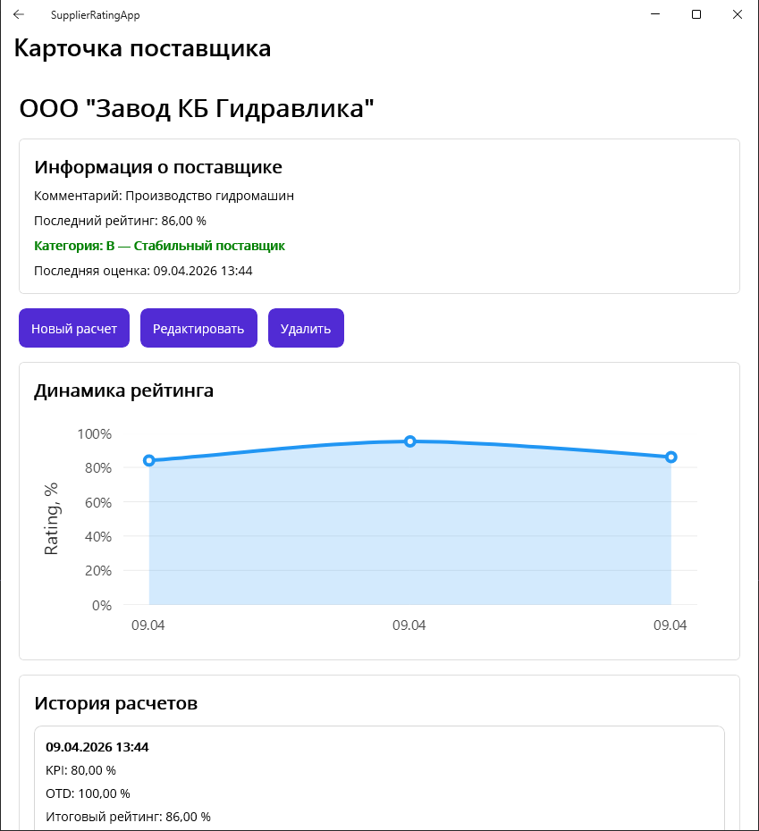

# 📊 Supplier Rating App

The lightweight desktop application built with .NET MAUI allows users to calculate supplier ratings based on quality (KPI) and delivery performance (OTD), store results in a shared SQLite database, and analyze rating history over time.



## 🚀 Features

📦 Supplier management (create, edit, delete)

📈 Rating calculation based on:

  * KPI (quality of delivered parts)
  * OTD (on-time delivery)

🧮 Final rating formula:

  ```
  Final Rating = KPI * 0.7 + OTD * 0.3
  ```

🏷️ Automatic supplier categorization:

  * **A (90–100%)** – Elite supplier
  * **B (75–89%)** – Stable supplier
  * **C (50–74%)** – Problematic supplier
  * **D (<50%)** – Unacceptable supplier

📚 Rating history tracking

📊 Rating trend visualization

🔍 Quick search (Google-like filtering)

🗄️ SQLite database (shared for multiple users)

## 🧱 Tech Stack

* .NET MAUI (Windows desktop)
* SQLite (`sqlite-net-pcl`)
* MVVM architecture
* Dependency Injection

## 🧮 Example Calculation

```
Total parts: 10
Good parts: 0
→ KPI = 0%

Deliveries: 2
On-time: 1
→ OTD = 50%

Final Rating = (0 * 0.7) + (50 * 0.3) = 15%
```

## 🖥️ Deployment (Shared Usage)

This application is designed for small teams (e.g., 2–5 users).

### Setup:

1. Publish the application (`Release / win-x64 / Self-contained`)
2. Copy all publish files to a shared network folder:

   ```
   \\SERVER\SupplierRatingApp
   ```
3. Ensure users have **read/write permissions**
4. Launch the app via shortcut:

   ```
   \\SERVER\SupplierRatingApp\SupplierRatingApp.exe
   ```

### Database

The SQLite database file:

```
supplier_rating.db3
```

is automatically created **next to the executable** and shared between all users.

## ⚠️ Notes

* This setup is suitable for **pilot usage**
* SQLite over network is not ideal for high concurrency
* For production scenarios, consider migrating to **SQL Server**
